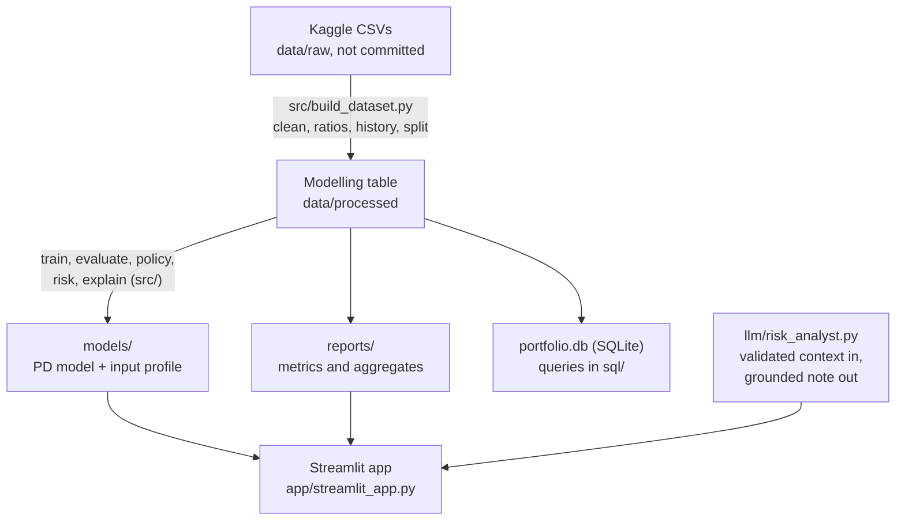

# AI-Powered Credit Risk & Loan Underwriting Analytics Platform

[](https://credit-risk-underwriting-platform-n6tcxus3sywcegkfugegav.streamlit.app/)

**Live app:** https://credit-risk-underwriting-platform-n6tcxus3sywcegkfugegav.streamlit.app/

Educational portfolio project. It is not a lending policy, risk thresholds and financial assumptions are project-defined and illustrative, and predictions must not be treated as real credit decisions.

## Question
How can customer and loan data identify credit risk, estimate the probability of default, explain why an applicant is risky, estimate financial exposure, and support underwriting decisions?

## Results (test split, opened once)
| | Gradient boosting | Logistic benchmark |
|---|---|---|
| ROC-AUC | 0.775 | 0.763 |
| PR-AUC (random 0.081) | 0.270 | 0.252 |
| Brier (constant rate 0.0742) | 0.0665 | 0.0674 |

Probabilities are calibrated in every decile. Five risk bands have actual default rates of 1.7%, 4.3%, 8.0%, 13.2% and 25.5%. External scores are the most valuable inputs (removing them costs 0.033 AUC); history tables add about 0.009 AUC. The best approval cutoff depends on assumed loss and margin (6% to 30% across the ranges tried). Full reasoning: `docs/final_report.md`.

## Architecture



## Documents
- `docs/decision_log.md`: 36 decisions with evidence, rejected alternatives and interview explanations
- `docs/methodology.md`, `docs/data_dictionary.md`, `docs/model_card.md`, `docs/final_report.md`, `docs/architecture.md`
- `docs/interview_questions.md` (58 Q&As), `docs/resume_versions.md`

## Notebooks
| # | Topic |
|---|---|
| 01 | Business framing and data audit |
| 02 | EDA and statistical tests |
| 03 | Feature engineering and timing checks |
| 04 | Logistic baseline and preprocessing tests |
| 05 | Model comparison, alternate-data value, ablations |
| 06 | Light tuning and calibration |
| 07 | Approval thresholds and the final test |
| 08 | Segment errors, explanations, risk bands, expected loss |
| 09 | SQL analytics |

## Setup
```
python -m venv .venv && source .venv/bin/activate
pip install -r requirements-dev.txt
cp .env.example .env
# put the Kaggle files in data/raw/ (see data/README.md), then:
python -m src.build_dataset
# run notebooks 04-08 (they write models/ and reports/), then:
python -m src.export_app_data
streamlit run app/streamlit_app.py
pytest
```
Set `ANTHROPIC_API_KEY` to enable the LLM analyst; without it the app shows a deterministic template note.

## Status and limitations

The full pipeline, the notebooks, the SQL analytics, the Streamlit app and the LLM analyst have been run end to end, and the app is deployed (link at the top).

Known limitations:
- **No time dimension.** The data has no dates, so validation uses one random split. Nothing is known about performance after economic change.
- **Label.** The target is early repayment difficulty, not lifetime default. Loss and margin figures are illustrative assumptions.
- **Age and gender** are model inputs. Removing them costs about 0.0025 AUC. The issue is documented in `docs/model_card.md` and the decision log (D31), and the app never asks for gender.
- **Explanations** use permutation importance and occlusion, not SHAP.
- **Data licence.** The repository ships no raw data. Kaggle's rules on public deployment have not been checked.